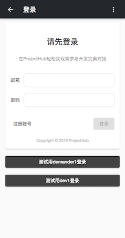
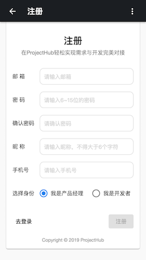
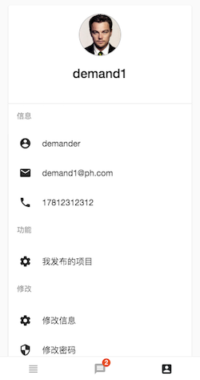
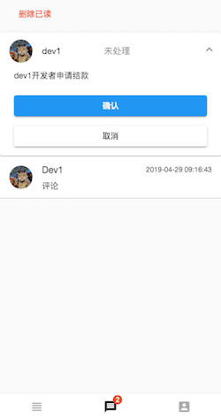

# Project-Hub

中文名还没想好

这个项目是我在学习 angular 时做的，同时临近毕业打算作为毕业设计。项目分为 [移动客户端](https://github.com/xjonson/ProjectHub-Client)、[PC端后台管理](https://github.com/xjonson/ProjectHub-Admin)、[server端](https://github.com/xjonson/ProjectHub-BackEnd)。这是移动客户端。

## 介绍

- ~~当前使用fake api，将来会使用node代替~~已经使用node后端提供api
- 用户可以注册、登录，除管理员外具有 需求方(demander)和开发方(developer)身份
- 需求方可发布项目需求，经过后台审核通过后可展示在项目大厅
- 开发方可查看项目、留言、申请接单
- 通过需求方审核后的会确定项目的开发方，双方互相对接，推动项目的开发


## 开发环境

- Node.js v8.9.4
- Angular v7.3.0
- Angular Material v7.2.0
- TypeScript v3.2.2
- json-server v0.14.2


## 使用

请先确保你已拥有以上环境

```bash
git clone git@github.com:xjonson/ProjectHub-Client.git
```

```bash
cd ProjectHub-Client

npm install

npm run dev
```

然后打开 [http://localhost:4200/](http://localhost:4200/) 即可预览效果

server端api请[移步这里](https://github.com/xjonson/ProjectHub-BackEnd)

## 展示

