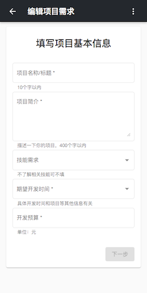

# Project-Hub

中文名还没想好

这个项目是我在学习 angular 时做的，同时临近毕业打算作为毕业设计。项目分为 [移动客户端](https://github.com/xjonson/ProjectHub-Client)、[PC端后台管理](https://github.com/xjonson/ProjectHub-Admin)、[server端](https://github.com/xjonson/ProjectHub-BackEnd)。这是移动客户端。

## 介绍

- 当前使用fake api，将来会使用node代替
- 用户可以注册、登录，除管理员外具有 需求者(demander)和开发者(developer)身份
- 需求者可创建项目需求
- 开发者可和需求者对接，进行项目的开发


## 开发环境

- Node.js v8.9.4
- Angular v7.3.0
- Angular Material v7.2.0
- TypeScript v3.2.2
- json-server v0.14.2


## 使用

请先确保你已拥有以上环境

```bash
git clone git@github.com:xjonson/ProjectHub-Client.git
```

```bash
cd ProjectHub-Client
```

```bash
npm install  # 或 cnpm install
```

```bash
npm run dev
```

然后打开 [http://localhost:4200/](http://localhost:4200/) 即可预览效果

项目部分页面请求接口会报错，是因为项目中使用了[json-server](https://github.com/typicode/json-server) 的 fake REST-API，所以还要全局安装一下 json-server

新建一个终端，执行

```bash
sudo npm install -g json-server

# windows use: 
npm install -g json-server
```

```bash
cd ./server

json-server --watch db.json
```

至此项目即可正常运行

将来会使用node做一个server端

## 展示





